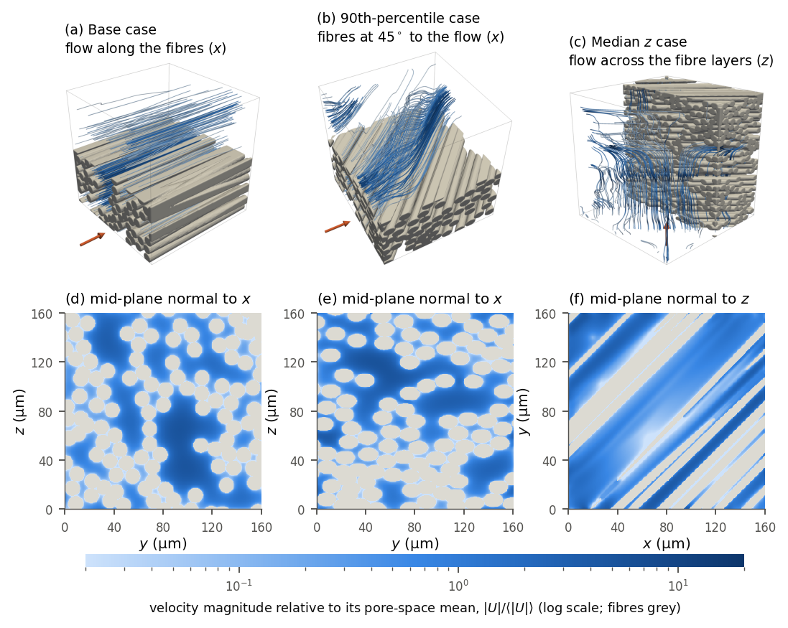

# Study: runtime control of under-relaxation with a zero-training judgment model

The research code, every run result, every model decision and the analysis behind `jevGovernor`. The packaged tool
is in [`../governor`](../governor); how the two relate: [`../docs/RELATION.md`](../docs/RELATION.md).

The study asks four questions: does adaptive control of the under-relaxation factors beat the solver defaults and
the best fixed pair? Does a judgment model beat simple thresholds that see the same features? How does it compare
with a reinforcement-learning policy? And what is left of the gains in wall-clock time once every model call is
paid for?

A runtime controller for OpenFOAM `simpleFoam`-type solvers. Every *N* outer iterations, code condenses the
residual history into a short verbal state; a zero-training judgment model ([TypeSafe Jev](https://docs.typesafe.ai),
a "System One" model that returns calibrated probabilities for typed questions) answers four yes/no questions
(*diverging? safe to accelerate? stagnating? stuck at a high factor?*); code maps the answers to a bounded
multiplicative move of the momentum factor in pseudo-time-step form, sets the pressure factor by the textbook
rule and enforces safety guards. A rule-based twin with identical features and actions serves as baseline.



## Main results (all numbers are generated from `data/` by `analysis/` into `results/`)

| | Result |
|---|---|
| Turbulent step of Pawar & Maulik (2021), 9 inflow velocities | converged in 27/27 runs, 428–507 iterations; template factors 1595–1881 (not converged at 25/30 m/s); their PPO policy trained on 2000 CFD runs ≈ 500; best fixed pair 0.98/0.9 (outside their action space) ≈ 410 |
| Lid-driven cavities | 0.19–0.59 of the default iterations — the rule-based twin is as good |
| pitzDaily | no gain (defaults are already near the best fixed pair) |
| Laminar backward-facing step | final design fails (0/15); the earlier variant with a permanent cap converges where the final one loops — the convergence landscape is non-monotonic in α_U, so no single back-off rule is robust |
| Wall-clock | a model call takes 0.29 s: synchronous coupling eats 33–50 % of the run time on small cases; asynchronous coupling reaches 0.38–0.39 of the default time |
| Transient PIMPLE runs (16 conditions, 8 held out; 2D/3D cavity, cylinder, pitzDaily URANS) | a third controller (same judgments, two-factor search, per-step guard): 0.44–0.85 of the default outer iterations per time step on the design set, 6 of 8 held-out conditions succeed (0.48–0.61); two fail (a crash after a trial beyond the stability cliff; a guard that mistakes a slow outer loop for an unstable one). The model decides like its rule-based twin |
| 7 fibre-permeability runs, 14–18 M cells | 0.20–0.69 of the default iterations, **21 h instead of 61 h**, permeability within 0.17 %, velocity field within 1.5 % — after a solver defect that let a history-based stopping rule end one run falsely had been fixed. Fixed factors 0.95/1.0: 36 h; fixed 0.98/1.0: equally fast (21 h) but one false stop in seven (ΔK −3 %); fixed 0.99/1.0: diverged or stopped falsely on 6 of 7 |

The study reports its negative results and its own defects: see [`docs/AUDIT.md`](docs/AUDIT.md).
The model is not deterministic: repeats agree on outcomes but not on iteration counts, and three repeats per
condition leave a few per-condition comparisons undecided — see [`docs/REPEATABILITY.md`](docs/REPEATABILITY.md).

## Repository layout

```
controller/benchmarks/frozen_v3    variant P (permanent cap) – frozen before the first held-out set, with SHA256SUMS
controller/benchmarks/frozen_v4    variant E (expiring cap)  – FINAL, frozen before the second held-out set was defined
controller/benchmarks/frozen_v4a   acknowledged asynchronous mode (ablation), frozen before its runs
controller/benchmarks/function_objects   coded OpenFOAM function objects for the synchronous / asynchronous hand-off
controller/benchmarks/tasks        task lists of all 1445 benchmark runs (+ the reference runs)
controller/benchmarks/case_scripts, tools   case preparation, profiles, collection
controller/transient/frozen_T      transient (PIMPLE) controller T, frozen before the held-out conditions were run; tasks, case scripts
controller/permeability            first-generation controller used for the large permeability runs + cluster scripts
cases/, cases_transient/           benchmark case templates (meshes are generated with blockMesh)
data/                              result tables, derived tables, compact histories, archives (decision records, 2D fields)
analysis/                          scripts that generate every table, figure and number in results/
results/                           generated: tables (Markdown), named numbers (CSV), figures (PNG/PDF)
tools/cluster/                     post-processing run on the cluster (log audit, field extraction, field differences)
docs/AUDIT.md                      what was checked, what was wrong, what was corrected
docs/REPEATABILITY.md              run-to-run variability of the model-based controllers (three repeats)
```

Each frozen controller directory contains `ctl3.py` (features, verbal state, questions, policy, rule-based twin),
`relaxctl.py` (run driver, solver hand-off), `foamlog2.py` (log parser) and `batch.py` (node-level batch runner).
Verify the freeze with `controller/benchmarks/verify_checksums.sh`. One line of the docstring of `ctl3.py` (a pointer to a document that is not part of this
repository) was reworded for the public release in all three frozen directories and `SHA256SUMS` was updated for that
file only; no code line changed. The checksums recorded at freeze time are listed in `docs/AUDIT.md`.

**Three controllers, one model.** The judgment model is used unchanged and untrained everywhere. The controller
code around it is hand-written per problem class: `controller/benchmarks` (steady residual convergence, variants P
and E), `controller/permeability` (first-generation, permeability-aware) and `controller/transient` (PIMPLE outer
loops). None of them was tested on a case family it had not seen.

## Reproducing the analysis

```bash
python3 -m venv .venv && .venv/bin/pip install numpy pandas matplotlib pyvista
./run_analysis.sh .venv/bin/python        # writes results/tables, results/numbers_*.csv, results/figures
```

The two figures that need the 3D fields (`fig_fibre3d`, panel (c) of `fig_perm_anatomy`) are skipped unless
`data/fields_3d/` exists; their committed versions in `results/figures/` are used instead. Every number quoted in
this README and in `docs/` is in one of the `results/numbers_*.csv` files.

## Data

| File | Content |
|---|---|
| `data/results_all.csv`, `results_v4a.csv` | one row per benchmark run: method, iterations, convergence, times, final factors, factor path, host, velocity error |
| `data/results_uerr_ref2.csv` | velocity errors of the turbulent cases against the recomputed long references |
| `data/results_t_governor.csv`, `data/archives/transient_governor_run_records.tar.gz` | jevGovernor 0.3.0 (PIMPLE mode) on the same 16 transient conditions: one row per run; steps, classes, decisions |
| `data/results_t.csv`, `data/archives/transient_run_records.tar.gz` | transient study: one row per run; outer iterations of every time step, every decision |
| `data/perm_results.csv`, `perm_fielddiff.csv` | permeability runs: iterations, times, permeability; L2 difference of the final 3D velocity fields |
| `data/derived/` | tables written by the analysis scripts (summaries per case and family, replication table, ablations) |
| `data/histories/` | per-iteration residuals, factor paths and permeability of the runs shown in the figures |
| `data/archives/benchmark_decision_records.tar.gz` | **every decision of every run**: the state sent to the model, the probabilities returned, the move taken, latency (plus `result.json`, `case.json`) |
| `data/archives/permeability_decisions.tar.gz` | every model decision of the permeability runs (state, probabilities, move, latency) |
| `data/archives/benchmark_fields_vtk.tar.gz` | final 2D fields of one run per benchmark family (VTK) |

Not in the repository: the raw benchmark solver logs (3.8 GB), the voxelised 3D fields (1.2 GB), the solver logs
and final fields of the permeability runs; the fibre-microstructure geometries and the in-house permeability solver
`simpleFoamMod` (not public), so `controller/permeability` documents what was run but cannot be run as is. The
solver patch that the permeability runs needed is one change:
`permConv.H` reads `convPermeability` (and the other stopping parameters) from `mesh.solutionDict()`, which
OpenFOAM re-reads when `system/fvSolution` changes, instead of from a private `IOdictionary` that is read once.

## Running the controller yourself

Requirements: OpenFOAM v2312 (the scripts call it through an Apptainer image; adapt `SIF` in `relaxctl.py`),
Python ≥ 3.9, `pip install typesafe-sdk`, and a TypeSafe API key in the environment variable `TYPESAFE_API_KEY`
(never commit it). The rule-based twin (`--method heur4`) and fixed factors (`--method static`) need no key.

```bash
# prepare the case templates (cavity, laminar step, pitzDaily; meshes via blockMesh)
controller/benchmarks/case_scripts/prepare_cases.sh
# the Pawar–Maulik case is not redistributed here (their repository has no licence):
# clone https://github.com/Romit-Maulik/PAR-RL first; prepare_pm.sh derives the velocity cases from its base case
controller/benchmarks/case_scripts/prepare_pm.sh

python controller/benchmarks/frozen_v4/relaxctl.py cases/cavity_Re1000 runs/test --method jev4            # synchronous
python controller/benchmarks/frozen_v4/relaxctl.py cases/cavity_Re1000 runs/test --method jev4 --async    # asynchronous
python controller/benchmarks/frozen_v4/relaxctl.py cases/cavity_Re1000 runs/test --method heur4           # rule-based twin
python controller/benchmarks/frozen_v4/relaxctl.py cases/cavity_Re1000 runs/test --method static --relax 0.9 0.1
```

Paths inside the case-preparation and cluster scripts point to the author's cluster workspace and must be adapted.

## Licence and citation

See [`../LICENSING.md`](../LICENSING.md) (code GPL-3.0-or-later, data CC BY 4.0) and
[`../CITATION.cff`](../CITATION.cff).
